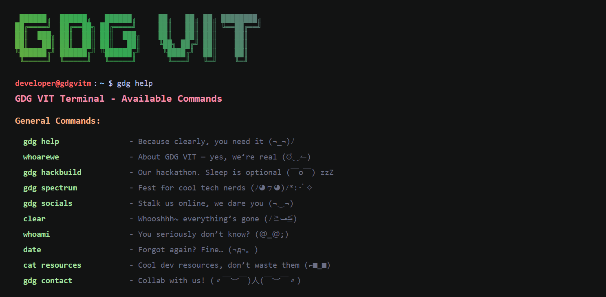

# GDG VIT Terminal </>

A playful, terminal‑style web interface for GDG VIT Mumbai built with React + Vite + Tailwind CSS. It simulates a Linux-like shell with fun responses, animated boot sequence, and custom commands to explore community info and resources.



---
## 🚀 Features
- Animated boot screen with ASCII banner
- Custom thick blinking block cursor
- Command history navigation (Arrow Up/Down)
- Rich command outputs (links, styled sections)
- Open external resources in a new tab
- Clean modular component structure

---
## 📦 Tech Stack
- React 19
- Vite 6
- Tailwind CSS v4 (via @tailwindcss/vite)
- ESLint (React hooks + refresh plugins)

---
## 🛠️ Getting Started

### 1. Clone
```bash
git clone https://github.com/GDGVITM/gdgvit-terminal.git
cd gdgvit-terminal
```

### 2. Install dependencies
```bash
npm install
```

### 3. Run in development
```bash
npm run dev
```

### 4. Open the app
Vite prints a local URL (usually http://localhost:5173). Open it in your browser.

### 5. Build for production
```bash
npm run build
```
Preview the build:
```bash
npm run preview
```

---
## ⌨️ Available Commands (in terminal UI)
Type these inside the on‑page terminal:

| Command | Description |
|---------|-------------|
| `gdg help` | Show all available commands |
| `whoarewe` | About the community |
| `whoami` | Playful identity hint |
| `date` | Current date/time |
| `gdg spectrum` | Event info + link |
| `gdg socials` | Social links list |
| `cat resources` | Show study resource commands |
| `gdg contact` | Contact email |
| `clear` | Clear the screen |

Resource shortcut commands (after `cat resources`): `gitsheet`, `jsguide`, `reactdocs`, `pythonref`, `cssguide`, `htmlref`, `algorithms`, `apidesign`, `dockerguide`, `flutterdev`, `cppref`, `cpalgos`, `computernetworks`, `dbms`, `oops`, `operatingsystems`, `pgbooks`.

---
## 🤝 Contributing
1. Fork the repo
2. Create a branch: `git checkout -b feat/awesome-thing`
3. Commit: `git commit -m "feat: add awesome thing"`
4. Push: `git push origin feat/awesome-thing`
5. Open a Pull Request

Please keep changes small and focused. Add screenshots for UI changes if possible.

---

Enjoy hacking in the terminal! </>
